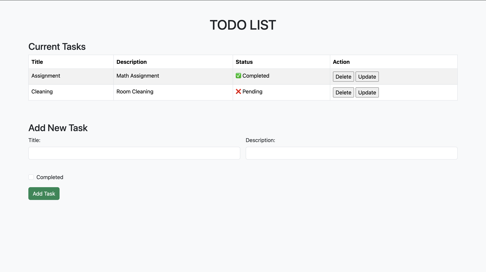
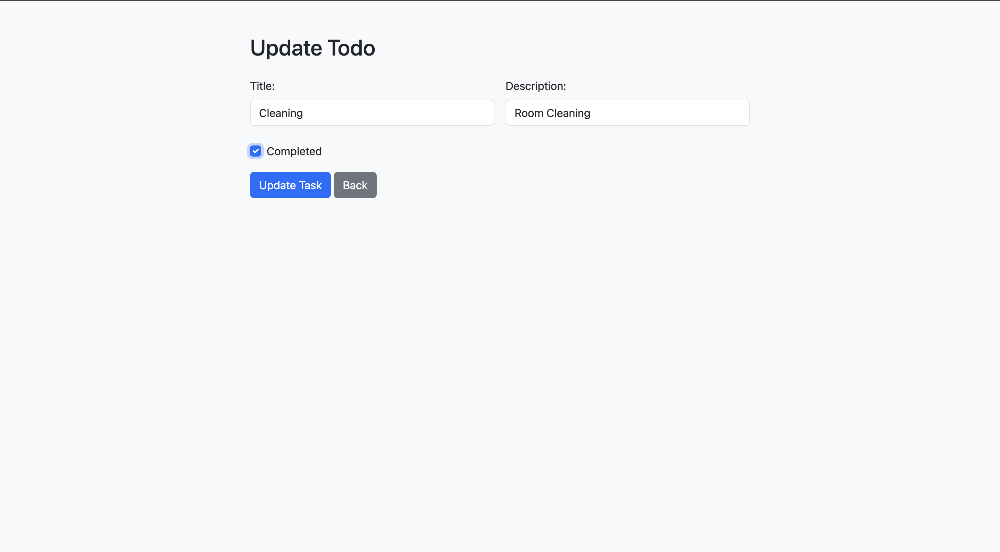

# 📝 Spring Boot Todo List Application

A simple yet elegant **Todo List Web Application** built with Spring Boot, Thymeleaf, and Bootstrap. This app allows users to create, view, update, and delete their daily tasks with ease.


---

## 🚀 Features

- ✅ Create new tasks
- 📝 View all tasks in a responsive table
- ✏️ Update existing tasks
- 🗑 Delete completed or outdated tasks
- 📋 Mark tasks as completed or pending
- 🎨 Clean UI with Bootstrap 5
- 💾 Data persistence using MySQL + Spring Data JPA

---

## 🛠 Tech Stack

| Layer            | Technology      | Version  |
| ---------------- | --------------- | -------- |
| Backend          | Spring Boot     | 3.5.3    |
| Language         | Java            | 21       |
| Template Engine  | Thymeleaf       | 3.1.1    |
| Frontend Styling | Bootstrap       | 5.3.3    |
| ORM              | Spring Data JPA | 3.1.2    |
| Database         | MySQL           | 8.0+     |
| Build Tool       | Maven           | 3.8.6+   |
| IDE              | Eclipse         | 2023-12+ |

---

## 📸 Screenshots

### 🏠 Home Page



### ✏️ Update Task



---

## ⚙️ How to Run This Project Locally

### 1️⃣ Clone the Repository

```bash
git clone https://github.com/your-username/todo-springboot-app.git
cd todo-springboot-app
```

### 2️⃣ Set Up MySQL Database

Create a database named todo_entity

Open src/main/resources/application.properties (create it if not exists)

Add your DB configuration:

# === Database Configuration ===
spring.datasource.url=jdbc:mysql://localhost:3306/todo_db

spring.datasource.username=your_username

spring.datasource.password=your_password

# === JPA Settings ===
spring.jpa.hibernate.ddl-auto=update

spring.jpa.show-sql=true

⚠️ Don't commit this file! Add it to .gitignore

### 3️⃣ Run the Application

👉 Using Maven:

    mvn spring-boot:run

👉 Or Run from Eclipse:

    Right-click the TodoApplication main class
    Select Run As → Java Application

### 4️⃣ Open in Browser

Visit: http://localhost:8080

🙋‍♂️ Author

Shivam Baghel
🌐 [LinkedIn](https://www.linkedin.com/in/shivam-baghel-897935220/) • ✉️ [Email](shivambaghelaug@gmail.com)
